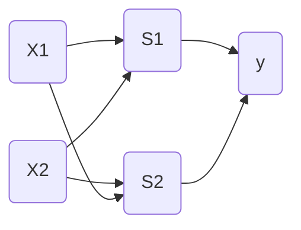

퍼셉트론은 프랑크 로젠블라트가 1957년에 고안한 알고리즘이다.
퍼셉트론은 신경망(딥러닝)의 기원이 되는 알고리즘이다.

# 퍼셉트론

퍼셉트론은 다수의 신호를 입력으로 받아 하나의 신호를 출력한다.
퍼셉트론은 복수의 입력 신호에 각각에 고유한 가중치를 부여한다. 가중치는 각 신호가 결과에 주는 영향력을 조절하는 요소로 작용한다. 즉, 특정 입력 신호의 가중치가 크다는 의미는 해당 신호가 그만큼 더 중요하다는 뜻이다.


위 그림은 입력 2개인 퍼셉트론이다. 그림의 원은 뉴력, 노드라고 부른다. 선 (edge)은 데이터의 흐름(flow)을 나타내는 길 (tensor로 이 흐름을 구현하므로 텐서플로이다.)

x1, x2는 입력신호, y는 출력 신호이다.

w1과 w2는 신호에 대한 가중치들이다.

입력신호가 뉴런에 보내질 때 각각 고유한 가중치가 곱해진다. 뉴런에서 보내온 신호의 총합이 정해진 한계(임계값)를 넘어설 때만 1을 출력한다. 이를 "뉴런이 활성화한다"라고 표현하기도 한다.


<br>
<br>

# 퍼셉트론으로 논리 회로 표현

매개변수 (w1, w2, θ) 일때 AND게이트, NAND게이트, OR게이트를 퍼셉트론으로 표현할 수 있다.

|x1|x2|y|
|-|-|-|
|0|0|0|
|1|0|0|
|0|1|0|
|1|1|1|

첫번재 **and게이트** 일때의 진리표이다. 
(0.5, 0.5, 0.7), (0.5, 0.5, 0.8) 등 수많은 경우에서 and게이트 조건이 만족된다.

|x1|x2|y|
|-|-|-|
|0|0|1|
|1|0|1|
|0|1|1|
|1|1|0|

두번째 **nand게이트** 일때의 진리표이다.
(-0.5, -0.5, -0.7) 조합이 가능하다.
and게이트를 구현하는 매개변수의 부호를 모두 반전하면 nand게이트가 된다.

|x1|x2|y|
|-|-|-|
|0|0|0|
|1|0|1|
|0|1|1|
|1|1|1|

세번째 **or게이트** 일때의 진리표이다.
(0.5, 0.5, 0.4) 조합이 가능하다.

이처럼 퍼셉트론으로 and, nand, or 논리회로를 표현할 수 있다.
지금은 사람이 직접 진리표라는 학습데이터를 보고 매개변수 값을 계산했지만 기계학습 문제는 이 매개변수의 값을 정하는 작업을 컴퓨터가 자동으로 한다. 학습이란 적절한 매개변수 값을 정하는 작업이며, 사람은 퍼셉트론의 구조(모델)를 고민하고 컴퓨터에 학습할 데이터를 주는 일을 한다.

여기서 중요한점은 **퍼셉트론의 구조는 and, nand, or게이트 모두 똑같다**는 것이다.
세가지 게이트에서 다른 것은 매개변수(가중치와 임계값) 값뿐이다.

<br>
<br>

# 퍼셉트론 구현하기

```python
def AND(x1, x2):
    w1, w2, theta = 0.5, 0.5, 0.7
    tmp = x1*w1 + x2*w2
    if tmp <= theta:
        return 0
    elif tmp > theta:
        return 1
```
위 코드처럼 and 게이트를 간단하게 구현할 수 있다.


```python
import numpy as np

def AND(x1, x2):
    x = np.array([x1, x2])
    w = np.array([0.5, 0.5])
    b = -0.7
    tmp = np.sum(w*x) + b
    if tmp <= 0:
        return 0
    else:
        return 1

if __name__ == '__main__':
    for xs in [(0, 0), (1, 0), (0, 1), (1, 1)]:
        y = AND(xs[0], xs[1])
        print(str(xs) + " -> " + str(y))
```
앞서 구현한 코드에 편향을 추가한 코드이다.


0 (w1*x1 + w2*x2 <= θ)
1 (w1*x1 + w2*x2 > θ)

0 (b + w1*x1 + w2*x2 <= 0)
1 (b + w1*x1 + w2*x2 > 0)

위 식을 보면 세타를 -b로 치환했다. 여기서 b는 편향이다.

**가중치와 편향의 차이점**은 가중치는 입력신호가 결과에 주는 영향력(중요도)을 조절하는 매개변수이고, 편향은 뉴런이 얼마나 쉽게 활성화(결과로 1)하느냐를 조정하는 매개변수이다.

```python
import numpy as np

def NAND(x1, x2):
    x = np.array([x1, x2])
    w = np.array([-0.5, -0.5])
    b = 0.7
    tmp = np.sum(w*x) + b
    if tmp <= 0:
        return 0
    else:
        return 1

def OR(x1, x2):
    x = np.array([x1, x2])
    w = np.array([0.5, 0.5])
    b = -0.2
    tmp = np.sum(w*x) + b
    if tmp <= 0:
        return 0
    else:
        return 1
```

위 코드는 nand, or 퍼셉트론이다.

<br>
<br>

# 퍼셉트론의 한계

xor게이트는 배타적 논리합이라는 논리회로다. 

|x1|x2|y|
|-|-|-|
|0|0|0|
|1|0|1|
|0|1|1|
|1|1|0|

x1, x2가 모두 같으면 0, 한쪽이라도 다르면 1을 출력한다.

**지금까지 본 퍼셉트론으로는 xor 게이트를 구현할 수 없다.**

and, nand, or의 경우 직선하나로 즉 선형 영역으로 영역 구분이 가능했지만,
xor의 경우 직선 하나로 나눈 영역을 표현할 수 없다. xor의 경우 곡선으로 즉 비선형 영역으로 표현이 가능하다.

이것이 퍼셉트론의 한계이다.

<br>
<br>


# 다층 퍼셉트론

xor을 표현하기 위해서 다층 퍼셉트론(multi-layer perceptron)을 이용하면 된다.

```python
from and_gate import AND
from or_gate import OR
from nand_gate import NAND


def XOR(x1, x2):
    s1 = NAND(x1, x2)
    s2 = OR(x1, x2)
    y = AND(s1, s2)
    return y
```

x1과 x2는 NAND와 OR 게이트의 입력이 되고, NAND와 OR의 출력이 AND게이트의 입력으로 이어진다.



xor의 퍼셉트론 구조이다. 왼쪽부터 0, 1, 2층이다.

and, or가 단층 퍼셉트론인 데 반해, xor는 2층 퍼셉트론이다.
이처럼 층이 여러개인 퍼셉트론을 다층 퍼셉트론이라고 한다.

**단층 퍼셉트론으로는 표현하지 못한 것을 층을 하나 늘려 구현**했다.

이처럼 퍼셉트론은 층을 쌓아(깊게 하여) 더 다양한 것을 표현할 수 있다.

<br>
<br>

# NAND에서 컴퓨터까지

nand게이트의 조합으로 컴퓨터가 수행하는 일을 재현할 수 있다.
이는 곧 퍼셉트론으로도 컴퓨터를 표현할 수 있다는 의미이다.

이론상 2층 퍼셉트론이면 컴퓨터를 만들 수 있다. 정확히는 시그모이드 함수를 활성화 함수로 이용하면 임의의 함수를 표현할 수 있다는 사실이 증명되었다.
처음에는 and, or 게이트 다음에는 반가산기와 전가산기, 그다음은 산술논리연산장치(ALU), 다음에는 CPU ...이런식이다.

퍼셉트론은 층을 쌓으면 비선형적인 표현도 가능하고, 이론상 컴퓨터가 수행하는 처리도 모두 표현할 수 있다.